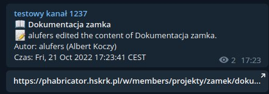

# phabricatorTeleNotifier

A bot for sending Telegram notifications from the  Phabricator feed.



## Installation

This bot is best used with docker. You can use this docker-compose.yml file to get started:

```yaml
version: 3
services:
  paczkobot:
    image: ghcr.io/HackerspaceKRK/phabricatortelenotifier:latest
    restart: unless-stopped
    volumes:
        - ./phabricator-notifier-config.yaml:/etc/phabricator-tele-notifier/phabricator-tele-notifier.yaml
```
## Configuration

You can use this configuration as a starting point for your `config.yml`

```yaml
phabricator:
  url: https://<PHABRICATOR_URL>/
  token: <TOKEN> # go to settings -> Conduit API Tokens
  poll_interval: 60s
telegram:
  token: <TOKEN> # go to @BotFather
  chat_id: <CHAT_ID> # forward a message from the channel you want the noificiations to go to to  @userinfobot 
  notify_types: ["WIKI", "TASK", "PROJ"] # can also be CEVT for events
```

## License

MIT
